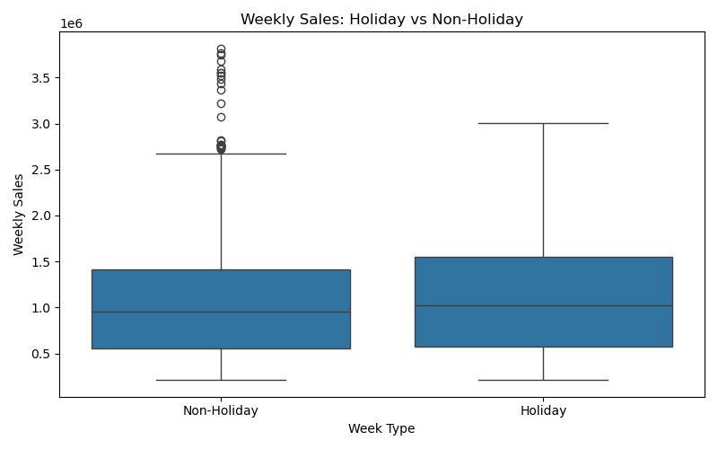
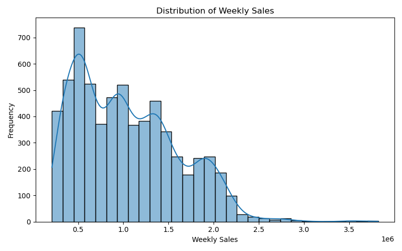
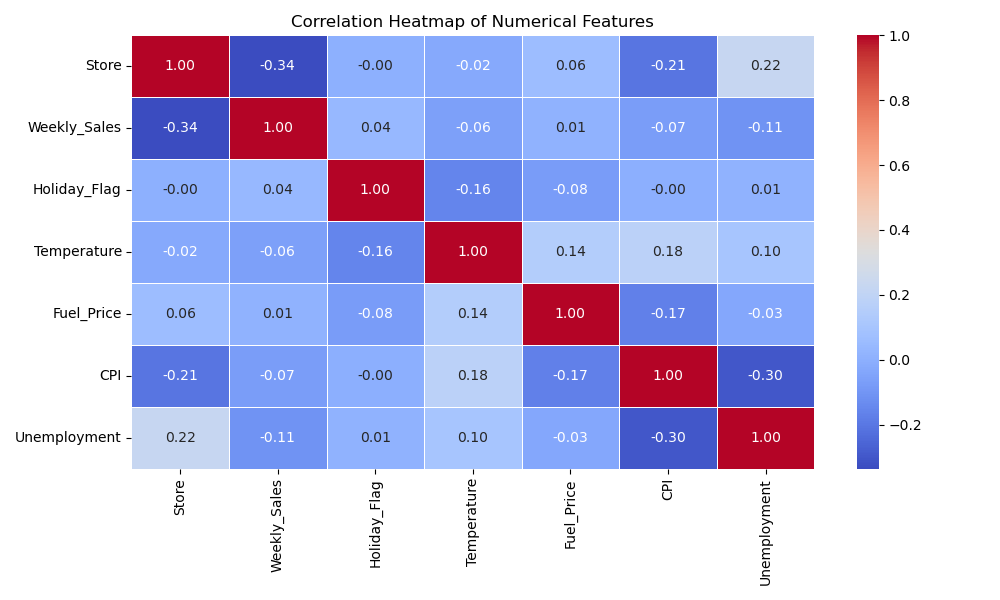

# 📊 Hypothesis Testing on Walmart Sales Dataset

## 📁 Project Overview
This project explores historical weekly sales data from Walmart and applies statistical hypothesis testing to draw business insights. Using Python-based data analysis tools, the project identifies whether holidays or store types significantly affect sales.

---

## 📌 Objectives
- Perform exploratory data analysis on Walmart sales data.
- Formulate and test null and alternative hypotheses.
- Use two-sample t-tests and ANOVA for validation.
- Visualize data distributions, group-wise comparisons, and correlations.
- Provide data-driven conclusions with clarity.

---

## 🧪 Hypotheses Tested

### 🔹 Hypothesis 1: Do Holiday Weeks Affect Sales?
- **Null Hypothesis (H₀):** Weekly sales during holiday weeks are not significantly different from non-holiday weeks.
- **Alternative Hypothesis (H₁):** Weekly sales during holiday weeks are significantly different from non-holiday weeks.
- **Test Used:** Two-sample independent t-test
- **T-statistic:** `2.680`
- **P-value:** `0.0076`
- ✅ **Conclusion:** **Reject H₀** — Weekly sales **do differ** significantly during holidays.

---

## 📈 Visualizations

### 📦 Holiday vs Non-Holiday Weekly Sales
This boxplot shows the distribution of weekly sales, grouped by holiday flag:



---

### 📊 Distribution of Weekly Sales
Histogram showing overall distribution of Walmart’s weekly sales:



---

### 🔥 Correlation Heatmap
Correlation among numeric variables in the dataset:



---

## 📄 Dataset Summary

| Feature         | Description                            |
|----------------|----------------------------------------|
| `Store`         | Store ID (numeric)                     |
| `Date`          | Week-end date                          |
| `Weekly_Sales`  | Total sales for the store in that week |
| `Holiday_Flag`  | `1` = Holiday week, `0` = Non-holiday  |
| `Temperature`   | Avg temperature that week (Fahrenheit) |
| `Fuel_Price`    | Avg fuel price that week               |
| `CPI`           | Consumer Price Index                   |
| `Unemployment`  | Unemployment rate                      |

- 📦 **Total Records:** 6,435 rows  
- 🚫 **Missing Values:** 0

---

## 🛠️ Technologies Used
- Python 3.9
- Pandas, NumPy
- Matplotlib, Seaborn
- Scipy (for t-test and statistical inference)
- Visual Studio Code
- Conda virtual environment

---

## 📂 Folder Structure

```
Hypothesis_Business_Analysis/
│
├── data/
│ └── Walmart.csv
├── notebook/
│ └── hypothesis_testing_main.py
├── visuals/
│ ├── holiday_sales_boxplot.png
│ ├── weekly_sales_histogram.png
│ └── correlation_heatmap.png
├── README.md
└── requirements.txt
```

---

## ✅ Conclusion
The analysis shows a statistically significant difference in weekly sales during holiday weeks, based on a low p-value from the t-test. This suggests that Walmart's promotional or seasonal strategies could be effectively influencing sales patterns during holiday periods.

---

## 🔗 Source
- Dataset: [Kaggle – Walmart Store Sales Forecasting](https://www.kaggle.com/datasets)

