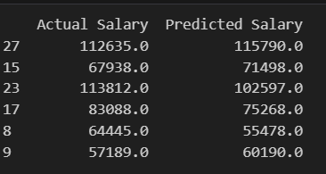

# Salary Prediction Using Linear Regression

This project implements a simple Linear Regression model to predict salaries based on years of experience. 

The analysis is performed using Python and common data science libraries such as pandas, numpy, matplotlib, and scikit-learn.

---

### Summary:

The goal is to build and evaluate a linear regression model that can predict an individual's salary based on their years of experience. 

The model achieved an R-squared score of ```0.9```, indicating a strong linear relationship and good predictive power.

---

### Steps:


**Import Libraries:** 

Imports numpy, pandas, matplotlib.pyplot, LinearRegression, train_test_split, mean_squared_error, and r2_score.

**Load Dataset:** 

Reads salary_data.csv into a pandas DataFrame.

**Data Exploration:**

df.head(): Displays the first few rows of the dataset.

df.info(): Provides a summary of the DataFrame, including data types and non-null counts.

df.describe(): Generates descriptive statistics for numerical columns.

**Data Visualization:** 

A scatter plot is generated to visualize the relationship between YearsExperience and Salary, showing a clear positive linear trend.

**Feature and Target Variable Selection:**

X (Feature): YearsExperience

y (Target): Salary

**Data Splitting:** 

The dataset is split into training (80%) and testing (20%) sets using train_test_split with random_state=42 for reproducibility.

**Model Training:** 

A LinearRegression model is initialized and trained on the X_train and y_train data.

**Prediction:** 

The trained model makes predictions on the X_test data.

**Model Evaluation:**

**Mean Squared Error (MSE):** 

Calculated to quantify the average squared difference between actual and predicted salaries.

**R-squared (R2) Score:** 

Calculated to determine the proportion of variance in the dependent variable that can be predicted from the independent variable(s).

**Coefficient and Intercept:** 

The slope (coefficient) and y-intercept of the regression line are extracted from the trained model.

**Prediction on User Input:** 

The notebook includes a section where a user can input a number of years of experience, and the model will predict the corresponding salary.

**Visualization of Regression Line:** 

A scatter plot of the training data is shown along with the fitted regression line.

---

### Key Findings and Interpretations:

**Strong Linear Relationship:**

The initial scatter plot clearly demonstrates a strong positive linear relationship between YearsExperience and Salary. 

As years of experience increase, salary tends to increase proportionally.

**Model Performance:**

**Mean Squared Error (MSE):** Approximately 49,830,097.0. 

While this number seems large, its interpretation depends on the scale of the salaries. 

Given salaries are in the tens to hundreds of thousands, this error is acceptable for a simple linear model.

**R-squared (R2) Score:** 0.9. 

This is a very high R-squared value, indicating that 90% of the variance in salary can be explained by the years of experience. 

This suggests that the linear regression model is a good fit for the data and years of experience is a strong predictor of salary in this dataset.

**Regression Equation:**

**Slope (Coefficient):** Approximately 9424.0. 

This means that for every additional year of experience, the predicted salary increases by approximately $9,424.

**Intercept:** Approximately 25322.0. 

This represents the predicted salary for an individual with zero years of experience.

---

### Sample Predictions:



---


### Salary prediction from user input:

user_input_years = float(input("Enter years of experience to predict salary: "))

Example: If user enters 6.0

Predicted Salary for 6.0 years of experience: $81866.00

Example: If user enters 66.0 (from notebook output)

Predicted Salary for 66.0 years of experience: $647293.39
