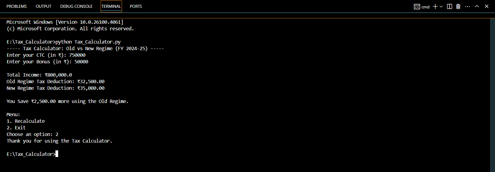

 **Tax Deduction Calculator - Old vs New Regime (FY 2024-25)**

 **Objective:**

This is a **console-based Python application** that calculates tax deductions under both the **Old** and **New Regime** based on the user's input **CTC** and **Bonus**.

**Features:**

-  Takes user input for Total CTC and Bonus
-  Calculates total income
-  Calculates tax based on:
  - Old Regime (with standard deduction + 80C)
  - New Regime (slab-based, no deductions)
-  Compares both regimes and recommends the best option
-  Menu-driven interface to recalculate or exit
-  Follows PEP8 standards and includes comments

 **How to Run This Program:**

1. Make sure you have **Python 3.x** installed.
2. Clone this repository:
   
   git clone https://github.com/YOUR-USERNAME/YOUR-REPO-NAME.git
   cd YOUR-REPO-NAME
3. Run the command to get the output:
   
   python tax_calculator.py

**Output:**

