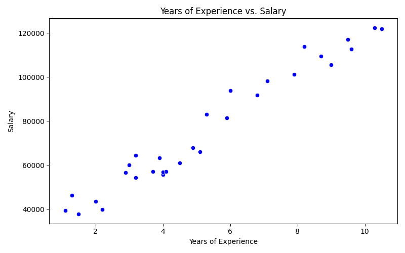
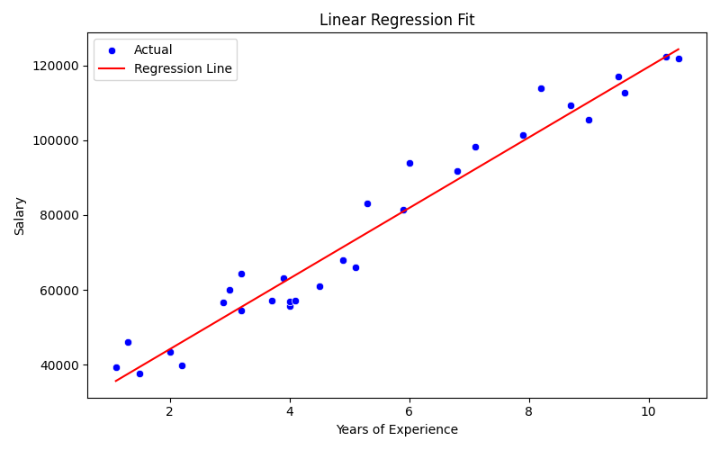
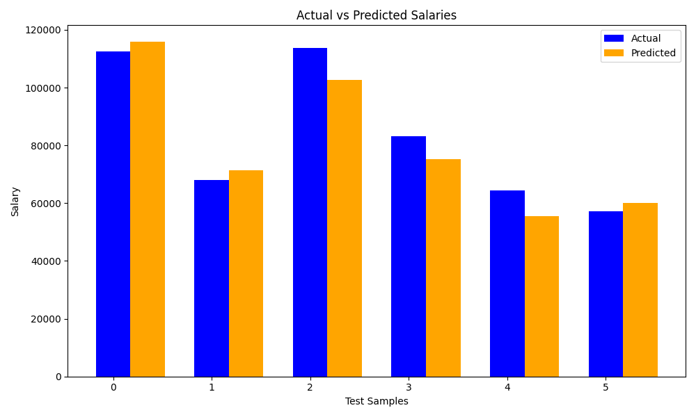

# 📈 Linear Regression - Salary Prediction Based on Experience

## 📁 Project Overview
This project applies **Simple Linear Regression** to predict an employee’s salary based on their years of experience. It demonstrates how statistical modeling can be used to forecast outcomes from real-world business data.

---

## 📌 Objectives
- Load and explore the `Salary_Data.csv` dataset.
- Visualize the relationship between experience and salary.
- Apply **Linear Regression** using scikit-learn.
- Split the dataset into training and testing sets.
- Train the model and evaluate it using **MSE** and **R² Score**.
- Predict salary for user-specified years of experience.
- Visualize regression results and predictions.

---

## 📊 Dataset Info

- **Source**: Public dataset (`Salary_Data.csv`)
- **Records**: 30 entries
- **Features**:
  - `YearsExperience` — float
  - `Salary` — float

All records are complete and contain no missing values.

---

## 🧪 Model Evaluation

| Metric            | Value        |
|------------------|--------------|
| Mean Squared Error (MSE) | `49,830,096.86` |
| R² Score                 | `0.9024`        |

✅ The model explains **90.24%** of the variance in salary based on years of experience.

---

## 📈 Visualizations

### 🎯 1. Experience vs Salary (Scatter Plot)


---

### 📐 2. Regression Line Fit


---

### 📊 3. Predicted vs Actual Salaries


---

## 🔍 Sample Prediction

The program allows user input at runtime to predict salary:

- 🔢 Enter years of experience to predict salary: 7.5
- 💼 Predicted Salary for 7.5 years of experience: ₹107,138.75


---

## 🛠️ Technologies Used
- Python 3.11
- Pandas
- NumPy
- Matplotlib & Seaborn
- Scikit-learn

---

## 📂 Folder Structure

```
Linear_Regression_Salary/
├── data/
│ └── Salary_Data.csv
├── notebook/
│ └── salary_prediction.py
├── visuals/
│ ├── scatter_with_regression.png
│ ├── regression_line_plot.png
│ └── predicted_vs_actual_bar.png
├── README.md
└── requirements.txt
```

---

## 🔧 Setup Instructions

```bash
pip install -r requirements.txt
python3 notebook/salary_prediction.py
```
---
## 👤 Author

**Suryesh Pandey**  
🎓 B.Sc (Computing),  
🏫 Bennett University   
🔗 LinkedIn: [linkedin.com/in/suryesh-pandey-61b7a2291](https://linkedin.com/in/suryesh-pandey-61b7a2291)
