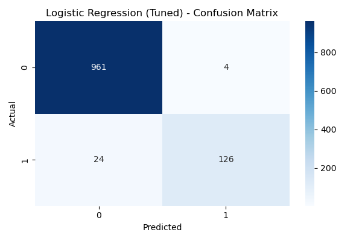
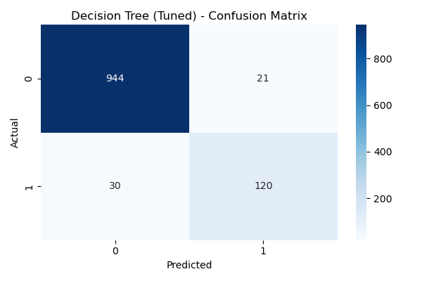
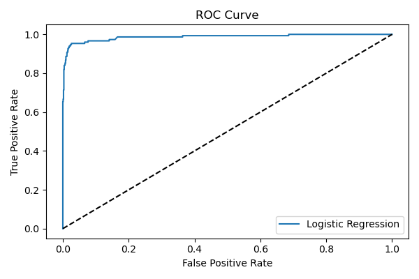
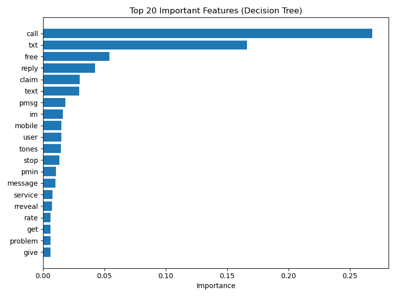

# 📧 Email Spam Detection Classifier

This project is part of **Assignment 7** and aims to classify emails/SMS as **Spam** or **Ham (Not Spam)** using machine learning models.

## 📁 Dataset
We used the [SMS Spam Collection Dataset](https://www.kaggle.com/datasets/uciml/sms-spam-collection-dataset), which contains 5,574 labeled messages.

## 🧠 Models Applied
- Logistic Regression
- Decision Tree Classifier
- GridSearchCV for hyperparameter tuning

## 🔍 Evaluation Metrics
Each model was evaluated using:
- Accuracy
- Precision
- Recall
- F1 Score
- Confusion Matrix
- ROC Curve

## 📊 Results

### Confusion Matrix (Logistic Regression - Tuned)


### Confusion Matrix (Decision Tree - Tuned)


### ROC Curve


### Feature Importance (Decision Tree)


## 📌 Project Structure

```
classification_spam_ham/
├── data/
│ ├── raw/
│ └── processed/
├── notebooks/
│ └── spam_classifier.ipynb
├── utils/
│ ├── preprocessing.py
│ └── model_utils.py
├── visuals/
│ └── plots/
├── README.md
├── requirements.txt
└── .gitignore
```
---

## 🛠️ Tools Used
- Python
- Scikit-learn
- Pandas
- Matplotlib / Seaborn
- NLTK (for text cleaning)

## 👤 Author
Suryesh Pandey  
B.Sc Computing, Bennett University  
🔗 [GitHub](https://github.com/SuryeshPandey) | [LinkedIn](https://linkedin.com/in/suryesh-pandey-61b7a2291)

---
